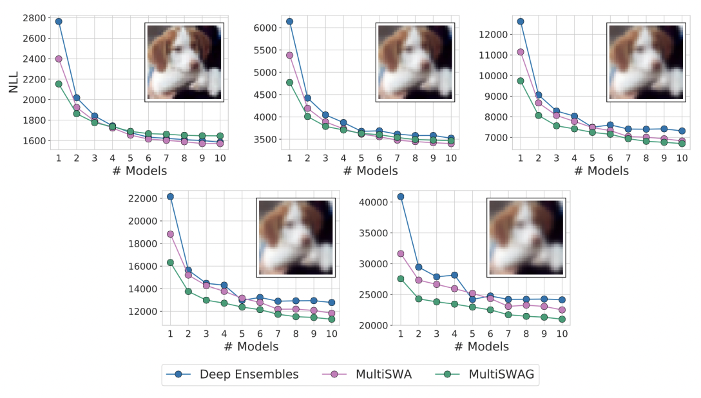
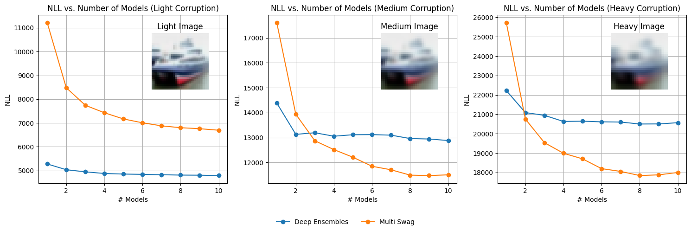

# Bayesian Deep Learning and a Probabilistic Perspective of Generalization

Advay Koranne (ak845) and Duncan Jurman(dj383). Cornell University CS 4782: Intro to Deep Learning. 
## 3.1 Introduction

### Overview
This project is a re-implementation of the paper **"Bayesian Deep Learning and a Probabilistic Perspective of Generalization"** by Andrew Gordon Wilson and Pavel Izmailov, presented at NeurIPS 2020. The primary contribution of the paper is the introduction of Bayesian marginalization in deep neural networks to improve accuracy and calibration. The method emphasizes using multiple weight configurations, further enhanced by Stochastic Weight Averaging-Gaussian (SWAG) to improve predictive distributions. The paper particularly focuses on training methods like SGD, SWA, SWAG, and the novel MultiSWAG model.

### Background and Motivation
1. **Bayesian Marginalization**: Used in deep neural networks to improve accuracy and calibration by considering multiple weight configurations rather than just one.
2. **Deep Ensembles**: Effective at approximating Bayesian marginalization, the proposed method further enhances predictive distributions by marginalizing within attraction basins without significant extra cost.
3. **SWAG (Stochastic Weight Averaging-Gaussian)**: Extends the ensemble method by approximating the posterior distribution of weights with a Gaussian. 

### Method: Bayesian Model Averaging (BMA)
$\[ p(y \mid x, \mathcal{D}) = \int p(y \mid x, w) p(w \mid \mathcal{D}) \, dw \]$

### Variables
- **Output ($y$)**: Output values (e.g., regression values, class labels)
- **Inputs ($x$)**: Input data (e.g., spatial locations, images)
- **Weights ($w$)**: Model parameters
- **Data ($\mathcal{D}$)**: Training data

### Explanation
The equation above represents the Bayesian model average (BMA). Instead of relying on a single hypothesis, i.e., one set of parameters $w$, Bayesian inference uses all possible sets of parameters, each weighted by their posterior probability, to compute predictions.

SWAG, which stands for **Stochastic Weight Averaging-Gaussian**, is a method used to improve the performance of neural networks by exploring the weight space more effectively. The process involves three main steps:

1. **Compute Moments**: Calculate the first two moments (mean and variance) of the SGD trajectory. This is based on the method described by Maddox et al. (2019).
2. **Gaussian Approximation**: Use these moments to construct a Gaussian approximation in the weight space.
3. **Bayesian Model Averaging**: Sample from this Gaussian distribution to perform Bayesian model averaging.

## Multi Stochastic Weight Averaging Gaussian (MultiSWAG)

1. Deep Neural Networks often exhibit "basins" where the loss is minimized.
2. MultiSWAG constructs a Gaussian mixture posterior by aggregating multiple independent SWAG solutions.
3. MultiSWAG, like ensembling, achieves Bayesian model averaging by leveraging diverse models to capture and quantify uncertainty.
4. MultiSWAG provides a computationally efficient approach to explore the model space and obtain a more comprehensive estimation of uncertainty.

## 3.2 Chosen Result

We aimed to reproduce the negative log likelihood performance of Deep Ensembles, MultiSWAG, and MultiSWA on the CIFAR-10 dataset under varying intensities of Gaussian blur corruption. This result demonstrates the effectiveness of MultiSWAG in capturing uncertainty and improving generalization compared to traditional deep ensembles. The relevant figure from the original paper illustrates the comparative performance of these methods under different conditions of data corruption. We will specifically just be looking at three different types of blur levels (light, medium, heavy) and comparing MultiSWAG vs. Deep Ensembles. 

  
  
<em>Figure 1: Comparative performance of Deep Ensembles, MultiSWAG, and MultiSWA under varying Gaussian blur corruption on CIFAR-10.</em>

## 3.3 Re-implementation Details

### Approach

1. **Model**: ResNet18 from torchvision.
2. **Dataset**: CIFAR-10, which consists of 60,000 32x32 color images in 10 classes (50,000 training images and 10,000 test images).
3. **Evaluation**: Performance assessed on three levels of image blurring: light, medium, and heavy.
4. **Ensembling**: 10 models were ensembled to evaluate their negative log likelihood.

### Running the Code

1. **Dependencies**: 
   - Python 3.8+
   - PyTorch
   - torchvision
   - numpy
   - matplotlib

2. **Instructions**:
   See SWAG.ipynb and run all the cells. 

### Computational Resources

- GPU is highly recommended for training due to the computational intensity of deep learning models.
- The implementation was tested on NVIDIA T4 GPU

## 3.4 Results and Analysis

### Re-implementation Results

For our re-implementation we implemented SWAG. Furthermore, the paper described how the blurring for multiple different blur levels but we decided on using the CIFAR-10 data set in PyTorch Torchvision and manually blur the images using a GaussianBlur where:
Light: sigma=0.5
Medium: sigma=1
Heavy: sigma = 2.0
The paper used PreResNet-20 but we decided on using resnet18 for simplicity and efficiency. We used the Negative Log-Likelihood (NLL) to benchmark the performance of MultiSWAG and Deep Ensembles. NLL computes the loss between model outputs and true labels by converting the labels to integers and using them to index into the outputs to get the predicted probabilities. It then calculates the negative log-likelihood by summing the logarithms of these probabilities and returns the result.

The re-implementation showed the following results:

- **MultiSWAG**: Achieved the best performance in terms of negative log likelihood under varying Gaussian blur intensities.
- **Deep Ensembles**: Provided robustness but were outperformed by MultiSWAG in terms of capturing uncertainty.

  
  
<em>Figure 2: Our re-implementation of the comparative performance of Deep Ensembles, MultiSWAG, and MultiSWA under varying Gaussian blur corruption on CIFAR-10.</em>

### Discrepancies and Challenges

- **Discrepancies**: There were minor differences in scaling for negative log likelihood compared to the original paper. This was hypothesized to be due to variations in hyperparameter settings and computational constraints. Another reason why the NLL values could be different is because we used just three general blur levels of (light, medium, and heavy) rather than the papers 5 different blur levels. 
- **Challenges**: One of the hardest parts of this paper was understaynding the idea of Bayesian Model Averaging and how that is similar to ensembeling. Furthermore, implementing SWAG was the most challenging aspect due to its complexity and the need for precise tuning.

### Analysis

Our results align with the paper's findings that Bayesian approaches, especially MultiSWAG, provide superior generalization by effectively capturing model uncertainty. This is crucial in real-world applications where uncertainty estimation can significantly impact decision-making. Looking at the plots in Figure 2 of our re-implementation we can clearly see that MultiSWAG outperformed Deep Ensembles under varying Gaussian blur corruption on CIFAR-10. However, one of the differences in our re-implementation was that it seems to be the case that for all the different blur levels in the original paper, MultiSWAG outperforms but in our re-implementation, it seems to be the case that for light blurring Deep Ensembles outperforms for all number of models and that for 1-2 model ensembling in medium and heavy blurring that DeepEnsenebles outperform. However, for both medium and heavy blurring we can see clearly that if we ensemble more than two models MultiSWAG significantly outperforms Deep Ensembles which verifies the results in the paper.

## 3.5 Conclusion and Future Work

### Key Takeaways

- Bayesian Deep Learning offers a robust framework for improving model generalization and uncertainty estimation. 
- MultiSWAG is an effective method for approximating Bayesian model averaging without significant computational overhead.

### Future Directions

- **Scalability**: Explore scalable implementations for larger datasets and deeper models.
- **Extensions**: Investigate other forms of Bayesian approximations and their impact on different types of neural network architectures.

## 3.6 References

- Wilson, A. G., & Izmailov, P. (2020). Bayesian Deep Learning and a Probabilistic Perspective of Generalization. Advances in Neural Information Processing Systems, 33.
- Izmailov, P., et al. (2019). Averaging Weights Leads to Wider Optima and Better Generalization. arXiv:1803.05407.
- Maddox, W., et al. (2019). A Simple Baseline for Bayesian Uncertainty in Deep Learning. arXiv:1902.02476.
